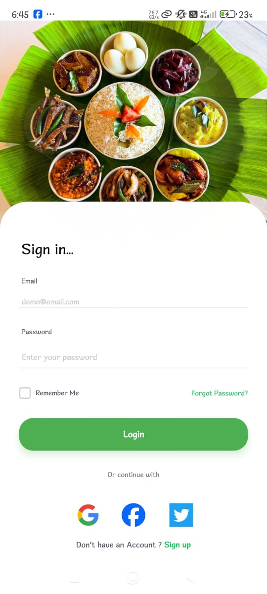

# 🍲 TasteLanka – Sri Lankan Recipes App

## Project Description
TasteLanka is a mobile application built with **React Native** that provides authentic Sri Lankan recipes. Users can browse recipes, view ingredients, follow step-by-step cooking instructions, filter recipes by category, and mark favorites. Admins can manage recipes, categories, and images via Firebase.

---

## Features

### User Features
- **User Authentication**: Register, login, and logout securely via Firebase.
- **Browse Recipes**: View recipes by category (Traditional, Street Food, Seafood, Desserts).
- **Recipe Details**: Ingredients, step-by-step instructions, serving suggestions in English & Sinhala.
- **Favorites**: Save recipes for quick access.
- **Search & Filter**: Search recipes by name or category.

### Admin Features
- **Recipe Management**: Add, update, and remove recipes.
- **Category Management**: Add or remove recipe categories.
- **Image Uploads**: Upload images via Firebase Storage.

---

## Technologies Used
- **Frontend**: React Native, Expo, TypeScript
- **Backend**: Firebase Firestore
- **Authentication**: Firebase Authentication
- **Storage**: Firebase Storage
- **State Management**: React Hooks, Context API
- **UI Components**: Tailwind CSS (`tailwind-rn`), Lucide React Native Icons

---

## Screenshots

### Welcome Page

### Login Page

### Home Page

### Recipe Details

### Categories Page

### User Profile

### Admin Panel

---

## Demonstration Video
Watch the full demonstration here: [YouTube Demo](https://www.youtube.com/watch?v=your-demo-link)

---

## APK / Build
Download APK: [TasteLanka APK](https://your-cloud-link.com/tastelanka.apk)

---

## License

This project is licensed under the MIT License. See the [LICENSE](LICENSE) file for details.

---

## Future Improvements

- Add push notifications for new recipes and featured dishes.
- Implement offline access for saved recipes.
- Add a rating and review system for recipes.
- Support multi-language beyond English and Sinhala.
- Enable social sharing for recipes on platforms like Facebook and WhatsApp.
- Advanced search and filter by category, ingredients, and cooking time.

---

## Acknowledgments

Special thanks to mentors, lecturers, and contributors who guided and supported the development of TasteLanka.  
Thanks to the Sri Lankan culinary community for inspiration and authentic recipe contributions.
